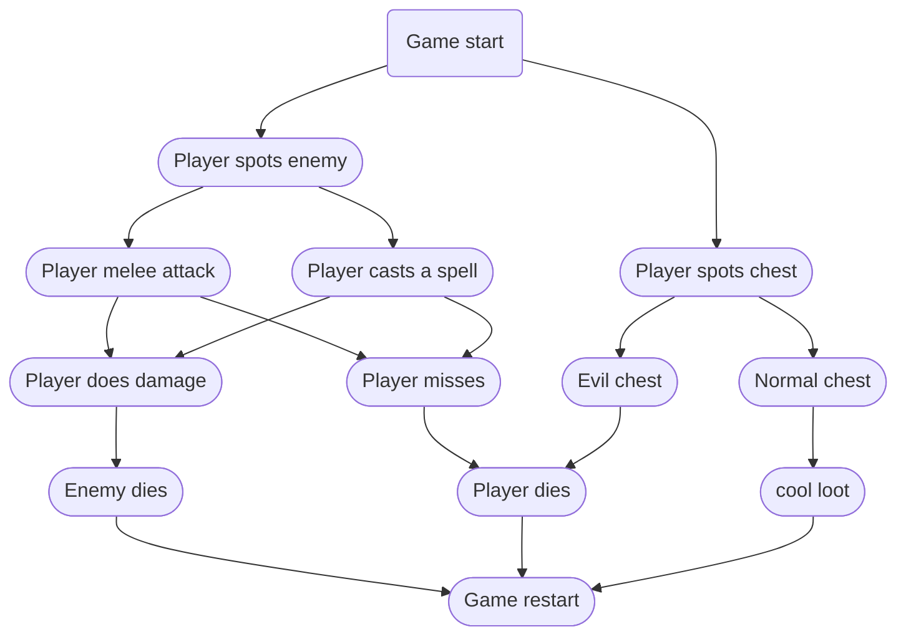

# Dungeon Crawler Feedback Loop
This chart represents a simple feedback loop commonly seen from videogames of the "dungeon crawler" genre. At the start of the game, a coin flip is done (physically or digitally), to determine if a chest appears, or an enemy appears. For ease of understanding, all players and enemies are assumed to be one-hit. One-hit meaning that if a player or enemy is hit once, they perish.

## Player spots enemy
The player has two options of attack: Melee and spells. If a player hits their attack, the enemy perishes. If a player misses their attack, the enemy brings the player to their unfortunate demise. Whatever the outcome, the game restarts, and the loop continues.

## Player spots chest
The normal chest carries loot (gold coins for nothing other than bragging rights), but there is also an Evil chest. I'm not going to elaborate much further on the Evil chest, but just know the Evil chest is sentient and Evil. The Evil chest will lead you to an unfortunate fate.
